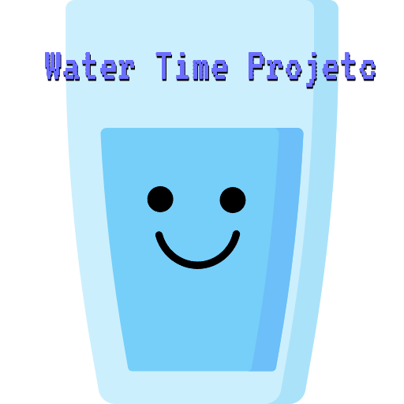
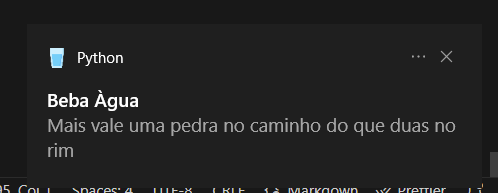

# Water Time Project
<p align="center">
  </a>
</p>

A simple project to remind you to drink water

### Requirements
**Python version**: 3.10.6 

**Windows version**: Windows 10 Home Single Language
> Not tested in other verisions of windows yet

**Libs**: _All libs required are in [requirements.txt](./requirements.txt) file, at project root_

### Usage
To use this project, use command pythow command to keep it in backgroud

E.G.

```shell
wattertimeproject/src> pythonw main.py
wattertimeproject/src>
```

By default, a notification like the image below will be displayed on your Windows every 40 minutes to remind you to drink water



### Configuration

#### Main Configuration
All settings can be found in the [config.yaml](./src/config.yaml) file

Lets explay all the keys

| key | type | default value | description |
|-----|------|---------------|-------------|
|interval | int | 50 | Time between notifications |
| type_interval | str | minutes | Value type for range, accepted values are described in the note below |
| lang | str | PT-BR | Language for presenting messages. See more in the language item |
| message_duration | int | 10 | Duration of display message |
| icon_path | str | ./images/glass-of-watter.ico | Location of message icon |
| lang_path | str |  ./lang/messages.json | language configuration path |

> type_interval: The valid values are:
>  * seconds: S, SEC, SECONDS
>  * minutes: M, MIN, MINUTES,
>  * hours: H, HOUR, HOURS

#### Language
Language file is a json with three keys:

| key | type | description |
|-----|------|-------------|
| lang |str | Language name, This value should be used in the lang parameter |
| title | str | Title in display message |
| message | str | Message to show |

##### Creating a new language
In [json file](./src/lang/messages.json) create a new key using the definition above, like this

```json
{
    "lang": "IT-IT",
    "title": "L'acqua potabile fa bene",
    "message": "Bevi qualche sorso"
}

```

Add this json to language file

```json
[
    {
        "lang": "PT-BR", 
        "title": "Beba Àgua",
        "message": "Mais vale uma pedra no caminho do que duas no rim"
    },
    
    {
        "lang": "EN-US",
        "title": "Drink watter",
        "message": "A stone in the road is better than one in the kidney"
    },

    {
        "lang": "ES-ES",
        "title": "Tiempo de Agua",
        "message": "¿Quieres que tus riñones sigan funcionando, muchacho?"
    },

    {
        "lang": "IT-IT",
        "title": "L'acqua potabile fa bene",
        "message": "Bevi qualche sorso"
    }
]
```

### Start with Windows

You can start the script in Windows when you logon.

Just create a powershell script or use the [run.cmd](run.cmd) and add this to Windows Task Scheduler


### Change logs

V 1.0 - Create project


